# Desafio DevOps #1 - Terraform EC2

Este projeto foi desenvolvido como solução para o desafio proposto no repositório original:

👉 https://github.com/bfeliano/desafio-devops-01-terraform-ec2-iniciante

---

## Objetivo

Provisionar uma infraestrutura na AWS utilizando Terraform, incluindo:

* VPC customizada
* Subnet pública
* Internet Gateway
* Route Table
* Security Group (HTTP + SSH)
* EC2 com Apache configurado automaticamente via `user_data`

---

## Tecnologias utilizadas

* Terraform
* AWS EC2
* AWS VPC
* Bash (user_data)

---

## Como executar o projeto

```bash
terraform init
terraform plan
terraform apply / terraform apply -auto-approve
```

---

## Resultado esperado

Após o deploy, acesse o IP público exibido:

```bash
public_ip = "SEU_IP_AQUI"
```

E você verá:

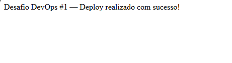

---

## Passos

1. Configuração do Terraform

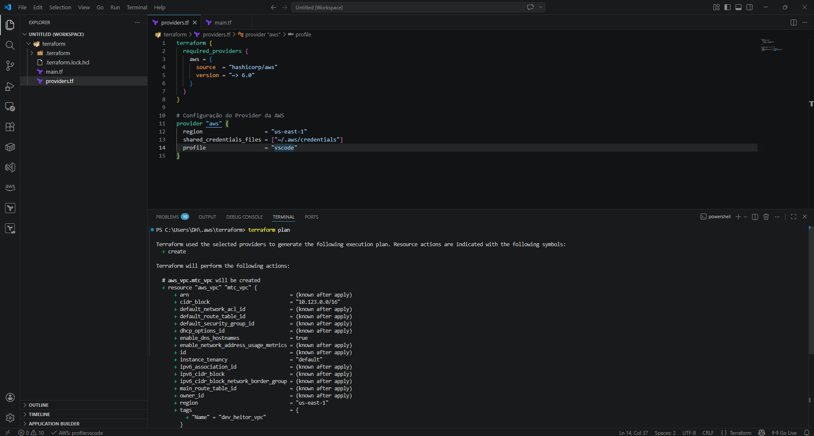

2. Criação da VPC

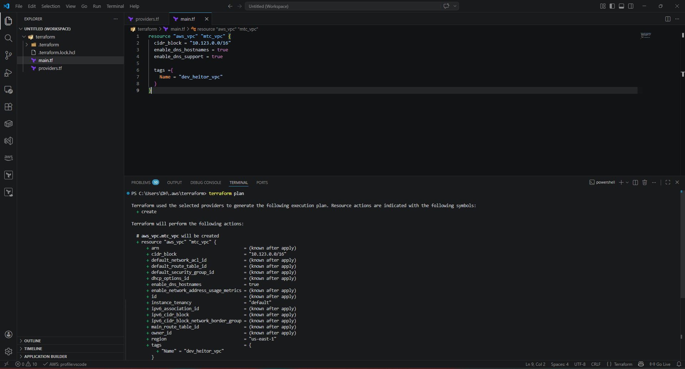
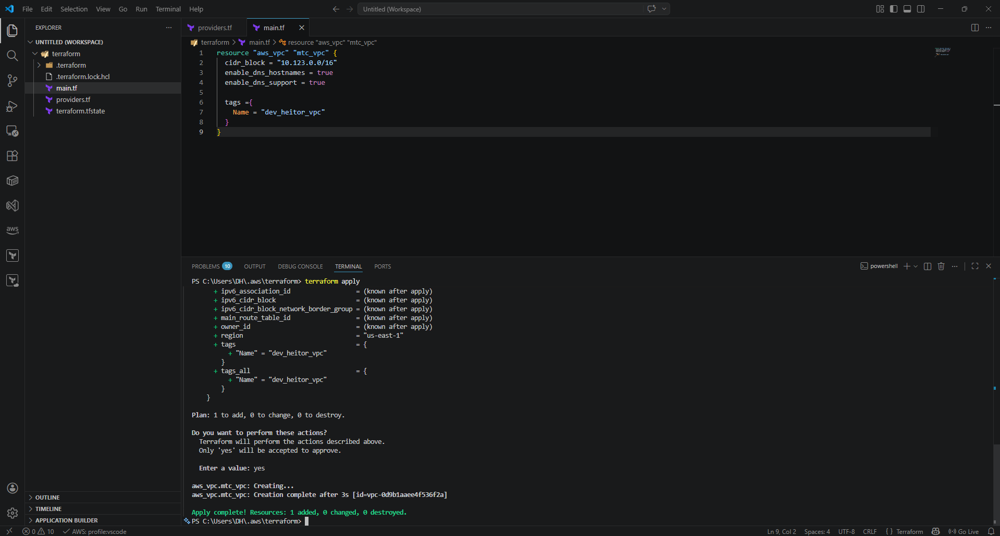
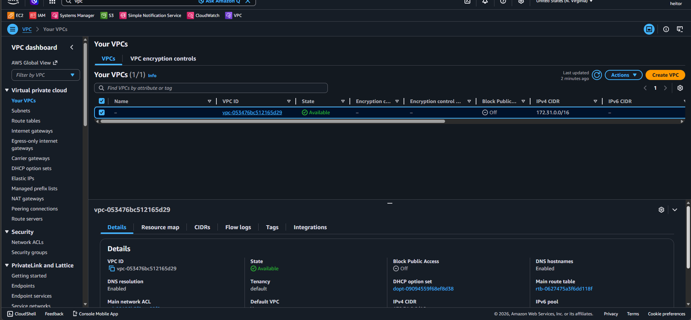
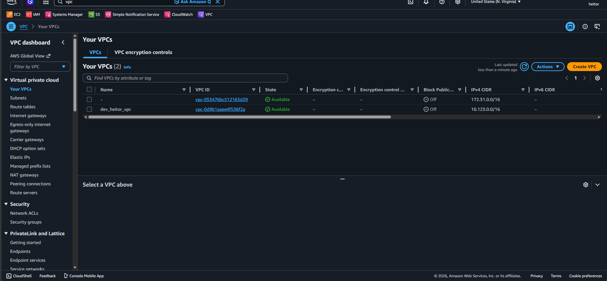

3. Criação da subnet e internet gateway

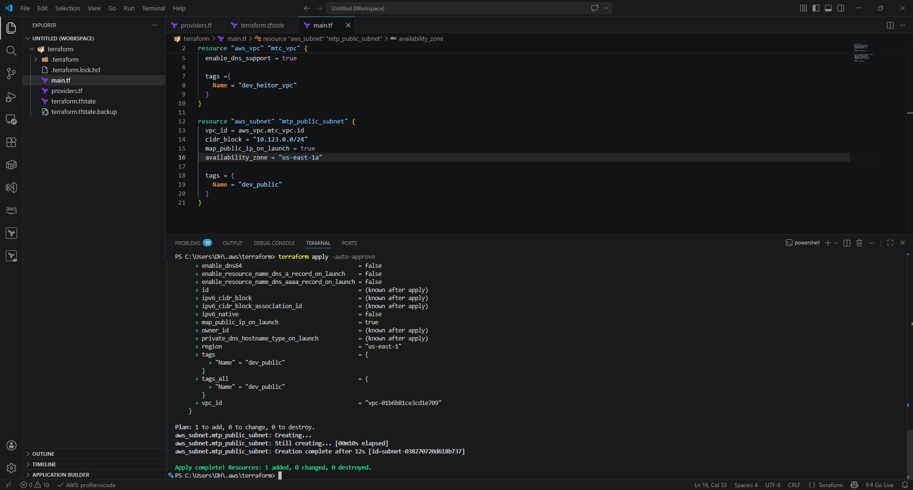
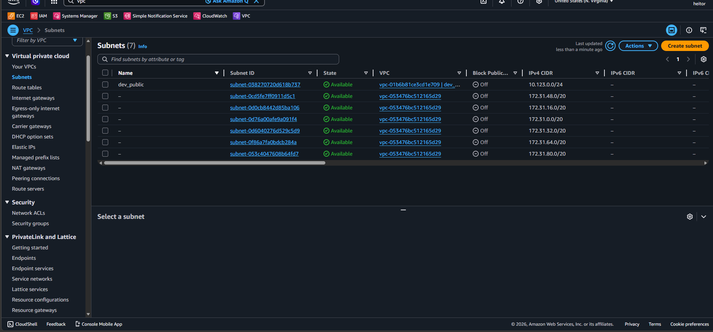
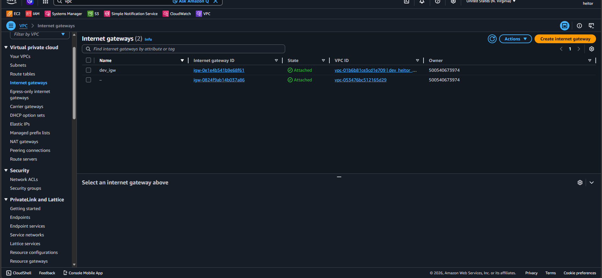

4. Criação da route table

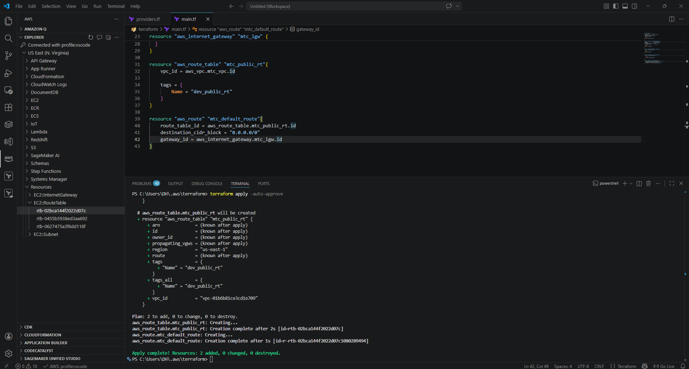
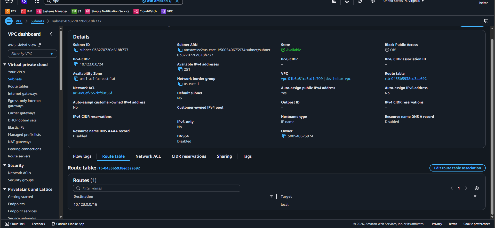
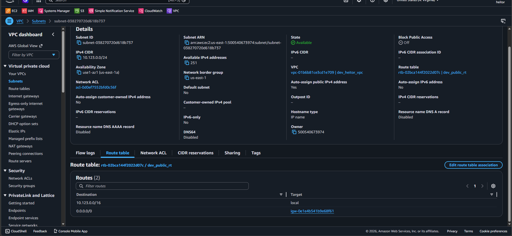
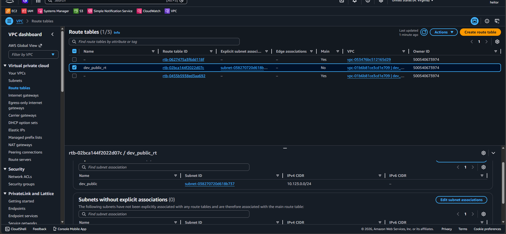

5. Configuração do security group

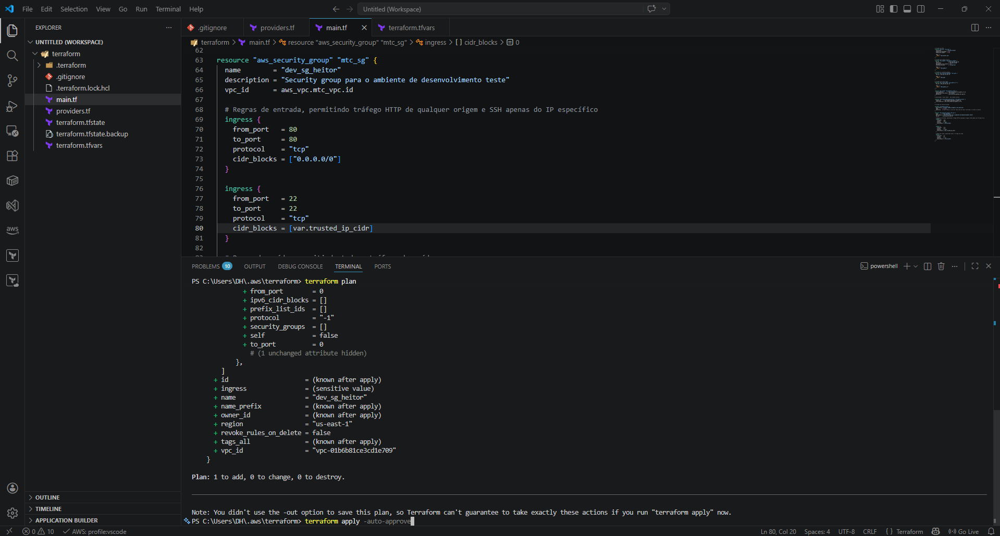
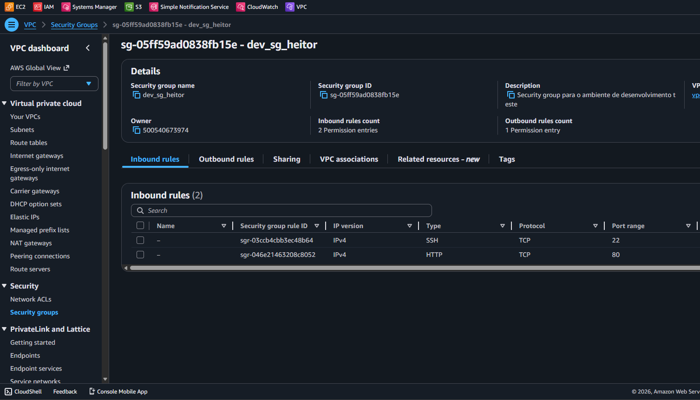

6. Configuração AMI e instância EC2

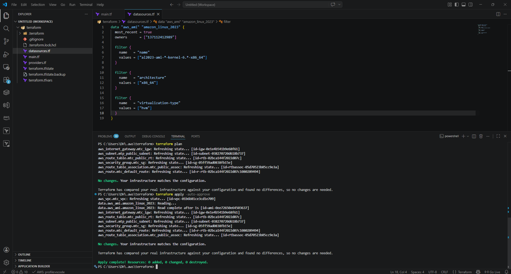
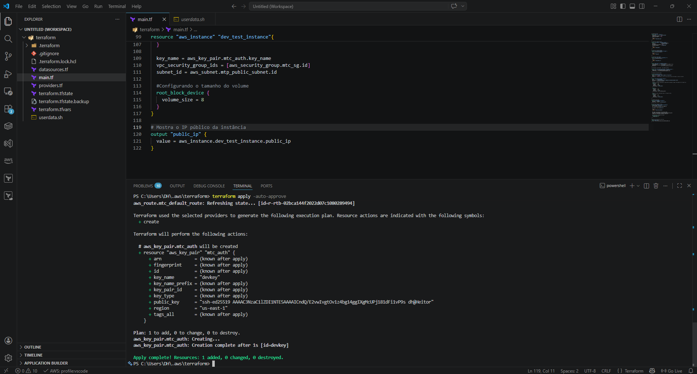
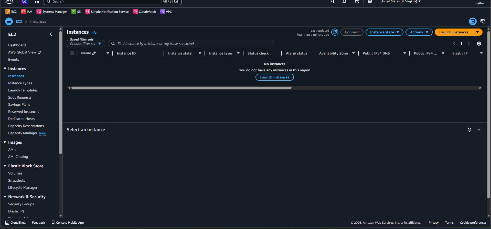
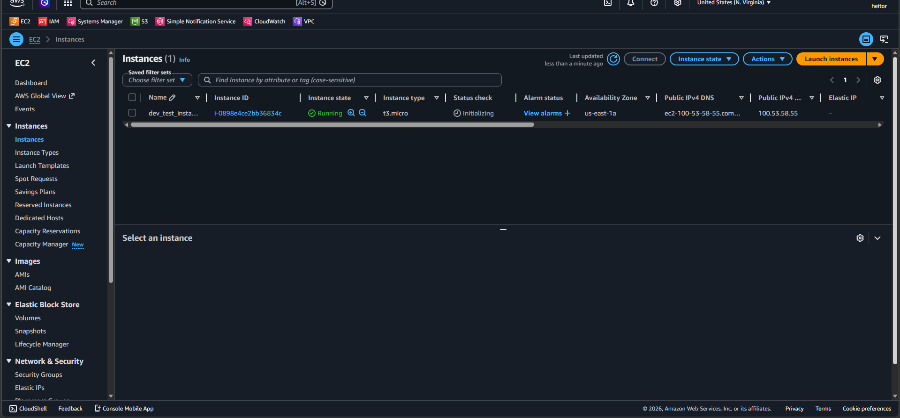
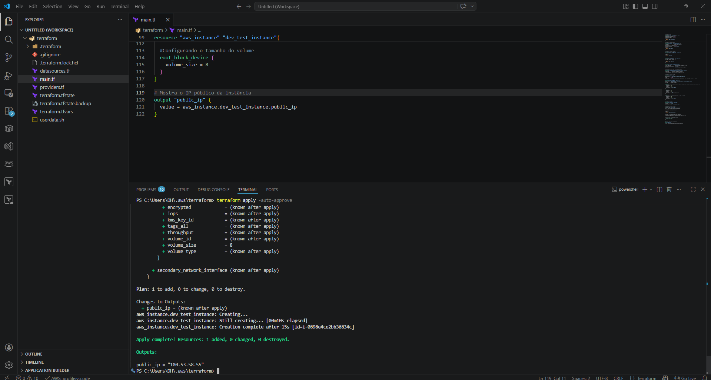

---

## 💡 Aprendizados

* Infraestrutura como Código (IaC)
* Configuração de rede na AWS
* Automação com Terraform
* Uso de `user_data` para provisionamento automático
* Boas práticas no Terraform e na conta free tier da AWS

---

## Referência

https://registry.terraform.io/providers/hashicorp/aws/latest/docs

## Licença

Este projeto está sob a licença MIT. Consulte o arquivo `LICENSE` para mais detalhes.